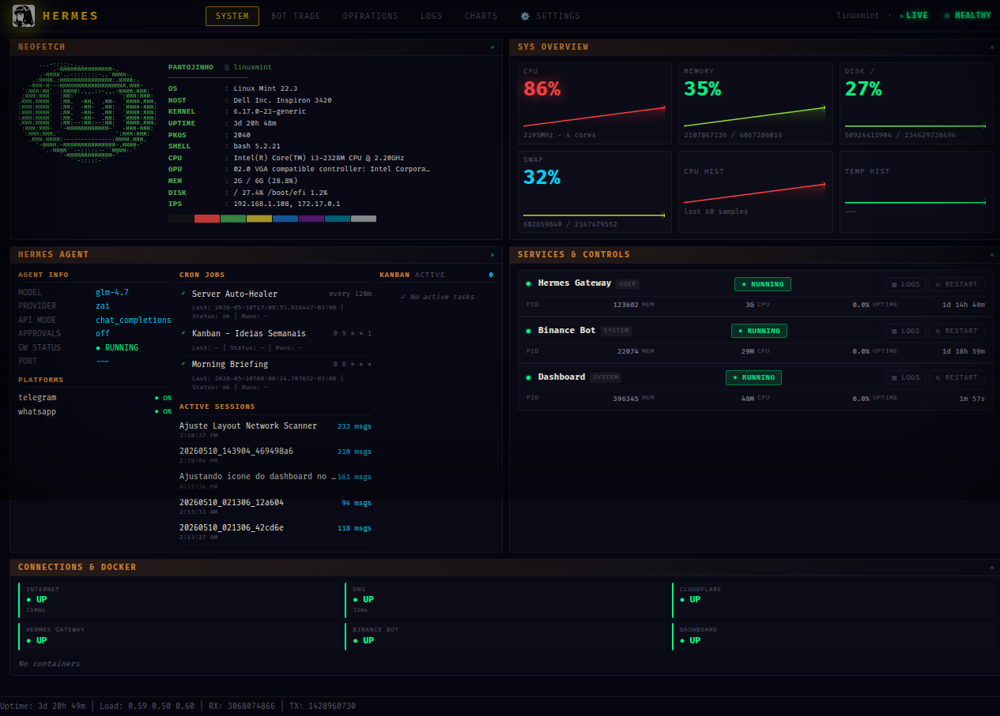

# Hermes Server Dashboard v3

A retro terminal-style web dashboard for monitoring Linux servers, Hermes Agent instances, and trading bots. Zero dependencies beyond Python — no Node.js build step, no external database.

Built for homelab setups, designed to be cloned, configured, and extended in minutes.



## Features

- **System Overview** — CPU, RAM, disk, swap, temperatures, network with live sparklines
- **Service Management** — Monitor and restart systemd services from the browser
- **Hermes Agent** — Live status of model, provider, platforms, cron jobs, sessions, kanban board
- **Trading Bot** — Binance bot integration with live P&L, regime, indicators, decision log
- **Time-Series Charts** — Embedded SQLite TSDB with Chart.js visualization (no Prometheus needed)
- **Log Viewer** — Real-time journalctl log viewer with filtering
- **Operations Panel** — Switch AI models, create config backups, quick actions
- **Network Scanner** — Discover devices on your LAN with vendor detection and auto-refresh
- **Health Panel** — Click the health badge for system resources + connectivity status
- **Plugin System** — Extend with custom tabs, API endpoints, and metric collectors
- **Feature Flags** — Sections auto-hide when integrations aren't configured (bot, miner, etc.)

## What's New in v3

- 🔍 **Network Scanner Plugin** — Discover LAN devices via nmap, shows vendor/type/IP/MAC
- 🏥 **Health Panel** — Click the HEALTHY/WARNING badge for detailed system health
- 🧩 **Feature Flags API** — `/api/features` auto-hides bot/miner sections when not configured
- 📡 **Manual Scan Button** — Force a network scan with ⟳ SCAN NOW
- 🎯 **Favicon** — Proper Hermes logo favicon in browser tab
- 📐 **Full-width Network Widget** — Network Scanner spans full width in Operations tab
- 🏷️ **Dynamic Hostname** — No more hardcoded hostnames, adapts to any machine

## API Documentation

The dashboard exposes a comprehensive REST API for system metrics, service management, and Hermes Agent integration.

**Interactive Documentation:**
- [Swagger UI (ReDoc)](http://localhost:18791/docs) — Interactive API explorer with "Try it out" functionality
- [ReDoc](http://localhost:18791/redoc) — Clean, reference-style documentation

Replace `localhost:18791` with your actual host and port if configured differently.

### Quick API Reference

- Endpoint | Method | Description
- `/docs` | GET | Swagger UI interactive documentation
- `/redoc` | GET | ReDoc reference documentation
- `/api/metrics` | GET | All system metrics + sparklines + services + hermes status
- `/api/health` | GET | Health status (system resources + connections)
- `/api/features` | GET | Feature flags (which integrations are enabled)
- `/api/kanban` | GET | Active kanban tasks from Hermes
- `/api/hermes` | GET | Hermes agent status, cron jobs, sessions
- `/api/hermes/models` | GET | Available AI models
- `/api/hermes/model` | POST | Switch AI model
- `/api/services` | GET | Monitored services status
- `/api/service/{name}/restart` | POST | Restart a service
- `/api/logs/{service}` | GET | Journalctl logs
- `/api/docker` | GET | Docker containers
- `/api/connections` | GET | Network connectivity checks
- `/api/backup` | POST | Create config backup
- `/api/graficos/dashboard` | GET | All TSDB chart data
- `/api/graficos/series` | GET | Single metric time-series
- `/api/network-scanner/devices` | GET | Discovered LAN devices
- `/api/network-scanner/scan` | POST | Force network scan
- `/api/plugins` | GET | List loaded plugins
- `/api/settings` | GET/POST | Dashboard settings
- `/bot-api/*` | GET | Proxy to trading bot API

## Requirements

- **Linux** (systemd-based)
- **Python 3.10+**
- **Hermes Agent** (optional — dashboard reads `~/.hermes/` for agent data)
- **nmap** (optional — for network scanner plugin)

## Quick Install

```bash
# Clone
git clone https://github.com/pantojinho/server-dashboard.git
cd server-dashboard

# Run installer (creates venv, installs deps, sets up systemd service)
chmod +x install.sh
./install.sh
```

The installer will:
1. Create a Python virtual environment
2. Install dependencies from `requirements.txt`
3. Generate `config.yaml` from `config.example.yaml`
4. Set up a systemd service (system, user, or manual)

## Manual Install

```bash
python3 -m venv .venv
.venv/bin/pip install -r requirements.txt
cp config.example.yaml config.yaml
# Edit config.yaml for your setup
.venv/bin/python3 server.py
```

## Configuration

Edit `config.yaml` (created from `config.example.yaml`):

- **Setting** | **Default** | **Description**
- `server.port` | `18791` | HTTP port
- `server.host` | `0.0.0.0` | Bind address
- `sudo_mode` | `"none"` | How to restart system services
- `services` | — | List of systemd services to monitor
- `metrics.scrape_interval` | `30` | Seconds between metric collections
- `metrics.retention_days` | `35` | Days of TSDB data to keep
- `integrations.bot_api_url` | — | Trading bot API URL (empty = hidden)
- `integrations.bitsy_url` | — | BitsyMiner ESP32 API URL (empty = hidden)
- `hermes.gateway_service` | `hermes-gateway.service` | Gateway systemd service name

### Environment Variables

- **Variable** | **Purpose**
- `SUDO_PASSWORD` | Password for sudo (if `sudo_mode: sudo_password`)
- `DASHBOARD_PASSWORD` | If set, enables Basic Auth on all endpoints
- `TELEGRAM_BOT_TOKEN` | For alert notifications
- `TELEGRAM_CHAT_ID` | For alert notifications
- `HERMES_HOME` | Path to Hermes config dir (default: `~/.hermes`)

### Sudo Modes

- `none` — Restart buttons won't work for system services
- `sudo_nopasswd` — Requires passwordless sudo configured
- `sudo_password` — Pipe password to sudo (set `SUDO_PASSWORD` env var)
- `systemd_user` — All services are user services, no sudo needed

## Plugin System

The dashboard supports plugins that add custom tabs, API endpoints, and metric collectors without modifying core files.

### Creating a Plugin

1. Create a `.py` file in the `plugins/` directory
2. Subclass `DashboardPlugin`
3. Override the hooks you need

```python
# plugins/my_plugin.py
from plugins.base import DashboardPlugin

class MyPlugin(DashboardPlugin):
    @property
    def name(self) -> str:
        return "my-plugin"

    @property
    def display_name(self) -> str:
        return "MY PLUGIN"

    def tab_html(self) -> str:
        return '<div class="panel"><div class="panel-header">My Plugin</div>' \
               '<div class="panel-body">Hello from my plugin!</div></div>'

    def register_routes(self, app):
        @app.get("/api/plugin/my-plugin/data")
        async def my_data():
            return {"status": "ok"}
```

Plugins are auto-discovered on server start.

### Plugin Hooks

- **Method** | **Purpose**
- `name` | Machine name (used in URLs)
- `display_name` | Tab label
- `tab_html()` | HTML content for the tab panel
- `scripts_html()` | JavaScript to include
- `styles_html()` | Additional CSS
- `register_routes(app)` | Register FastAPI endpoints
- `collect_metrics()` | Return metrics for TSDB (called every 30s)
- `on_load()` | Initialization hook

## Architecture

```
server.py              # FastAPI backend — API routes + metric collectors
metrics_tsdb.py        # SQLite time-series database with background collector
plugins/
  __init__.py          # Plugin system exports
  base.py              # DashboardPlugin base class
  loader.py            # Plugin discovery and registration
  network_scanner.py   # Network device discovery plugin
config.yaml            # User configuration (not committed to git)
config.example.yaml    # Template config (committed, safe defaults)
static/
  index.html           # Single-page dashboard (HTML + CSS + JS, no build step)
  hermes-logo.png      # Logo asset
  favicon.ico          # Browser tab icon
```

## Theme Customization

The dashboard uses CSS custom properties for theming:

```css
:root {
    --bg: #060610;           /* Main background */
    --bg-panel: #0a0a16;     /* Panel background */
    --text: #c8c0d0;         /* Primary text */
    --green: #00ff88;        /* Healthy/success */
    --red: #ff4444;          /* Error/critical */
    --cyan: #00d4ff;         /* Info/interactive */
    --yellow: #ffcc00;       /* Warning */
    --gold: #FFD700;         /* Highlight */
}
```

## Contributing

PRs welcome! The codebase is a single-page app with no build step — just edit and refresh.

## License

MIT
